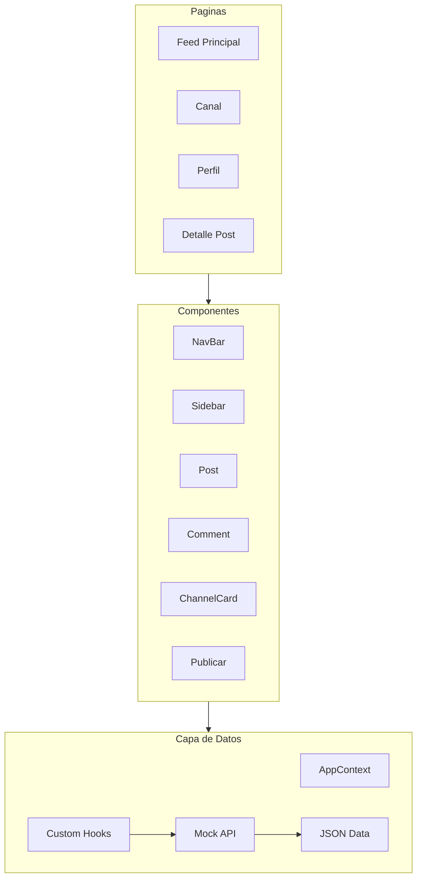

# Plan de Refactorizacion - Community Prototype

## Estado Actual del Proyecto

El prototipo fue generado con **Figma Make**, resultando en codigo funcional visualmente pero con problemas de mantenibilidad:

### Problemas Identificados

| Problema             | Ubicacion                          | Impacto                                |
| -------------------- | ---------------------------------- | -------------------------------------- |
| Archivo monolitico   | `FeedPrincipal.tsx` (2,379 lineas) | Dificil de mantener y testear          |
| Nombres genericos    | `Frame1-47`, `Container1-16`       | Sin significado semantico              |
| Colores hardcodeados | `#182831`, `#243f4c`, `#a7c1cd`    | No usa el sistema de diseño            |
| SVGs duplicados      | 70+ componentes SVG inline         | Codigo inflado                         |
| Sin routing          | Solo una pagina                    | No se puede navegar a canales/perfiles |
| Sin datos fake       | Contenido hardcodeado              | Dificil iterar en UI                   |

### Tecnologias Actuales

- React 18 + TypeScript + Vite
- Tailwind CSS v4 con tokens en `[src/styles/theme.css](src/styles/theme.css)`
- shadcn/ui (47 componentes en `[src/app/components/ui/](src/app/components/ui/)`)
- Framer Motion para animaciones
- Fuentes: Monument Grotesk, Figtree

---

## Arquitectura Propuesta



---

## ✅ Fase 1: Documentación y Preparación [COMPLETADA]

### ✅ 1.1 Crear README del proyecto

**Archivo:** `README.md` ✅

Documentar:

- ✅ Descripción del proyecto y objetivo
- ✅ Stack tecnológico
- ✅ Cómo ejecutar el proyecto
- ✅ Estructura de carpetas
- ✅ Convenciones de código
- ✅ Guía de contribución

### ✅ 1.2 Crear guía de tokens de diseño

**Archivo:** `docs/DESIGN_TOKENS.md` ✅

Documentar los colores de la comunidad y su mapeo:

- ✅ `#182831` = `--community-bg-primary`
- ✅ `#1c303b` = `--community-bg-secondary`
- ✅ `#243f4c` = `--community-border-default`
- ✅ `#a7c1cd` = `--community-text-muted`
- ✅ `#cfd9de` = `--community-text-secondary`
- ✅ `#7ee2b8` = `--community-accent-green`

---

## ✅ Fase 2: Sistema de Diseño y Tokens [COMPLETADA]

### ✅ 2.1 Extender tokens CSS

**Archivo:** `src/styles/theme.css` ✅

Agregar variables CSS para la comunidad:

```css
:root {
  /* Community color palette */
  --community-bg-primary: #182831;
  --community-bg-secondary: #1c303b;
  --community-bg-tertiary: #142129;
  --community-bg-card: #243f4c;
  --community-border-default: #243f4c;
  --community-border-accent: #2a5266;
  --community-text-primary: #ffffff;
  --community-text-secondary: #cfd9de;
  --community-text-muted: #a7c1cd;
  --community-accent-green: #7ee2b8;
  --community-accent-teal: #0c9494;
}
```

### ✅ 2.2 Crear sistema de iconos unificado

**Nuevo archivo:** `src/components/icons/index.tsx` ✅

Consolidar iconos de los 13 archivos `svg-*.ts`:

- ✅ Crear componente `Icon` reutilizable
- ✅ Iconos: home, bookmark, calendar, notifications, search, comment, favorite, share, repeat, more-horiz, arrow-forward, check, trophy, photo

---

## Fase 3: Extracción de Componentes

### 3.1 Sistema de Posts

**Nuevos archivos:**

- `src/components/post/Post.tsx` - Contenedor principal
- `src/components/post/PostHeader.tsx` - Info usuario + boton seguir
- `src/components/post/PostContent.tsx` - Texto + media
- `src/components/post/PostTags.tsx` - Tags de canal
- `src/components/post/PostActions.tsx` - Like/comment/share
- `src/components/post/PostImage.tsx` - Display de media

**Lineas a extraer de `[FeedPrincipal.tsx](src/imports/FeedPrincipal.tsx)`:** 766-1897

### 3.2 Sistema de Comentarios

**Nuevos archivos:**

- `src/components/comment/Comment.tsx`
- `src/components/comment/CommentList.tsx`
- `src/components/comment/CommentActions.tsx`
- `src/components/comment/CommentInput.tsx` (nuevo)

**Lineas a extraer:** 1059-1256

### 3.3 Navegacion

**Nuevos archivos:**

- `src/components/layout/NavBar.tsx`
- `src/components/layout/Logo.tsx`
- `src/components/layout/UserProfile.tsx`

**Lineas a extraer:** 23-226

### 3.4 Selector de Canales

**Nuevos archivos:**

- `src/components/channel/ChannelSelector.tsx`
- `src/components/channel/ChannelTab.tsx`
- `src/components/channel/ChannelCard.tsx`

**Lineas a extraer:** 286-313, mas `[CarroucelDeCanalesSugeridos.tsx](src/imports/CarroucelDeCanalesSugeridos.tsx)`

### 3.5 Sidebar

**Nuevos archivos:**

- `src/components/sidebar/Sidebar.tsx`
- `src/components/sidebar/SidebarProfile.tsx`
- `src/components/sidebar/SidebarEvents.tsx`

**Lineas a extraer:** 1925-2353

---

## Fase 4: Capa de Datos Fake

### 4.1 Tipos TypeScript

**Nuevo archivo:** `src/types/index.ts`

```typescript
export interface User {
  id: string;
  name: string;
  avatar: string;
  isFollowing: boolean;
}

export interface Post {
  id: string;
  author: User;
  content: string;
  image?: string;
  tags: string[];
  channelId: string;
  likes: number;
  comments: Comment[];
  isLiked: boolean;
  isBookmarked: boolean;
  createdAt: string;
}

export interface Channel {
  id: string;
  name: string;
  description: string;
  members: number;
  posts: number;
}
```

### 4.2 Datos Mock

**Nuevos archivos:**

- `src/data/users.json` - 10-15 usuarios fake
- `src/data/posts.json` - 20-30 posts variados
- `src/data/channels.json` - 8-10 canales
- `src/data/comments.json` - Comentarios de ejemplo

### 4.3 API Service

**Nuevo archivo:** `src/services/api.ts`

Funciones que simulan API con datos JSON:

- `getPosts(channelId?)` - Obtener posts
- `likePost(postId)` - Dar like
- `addComment(postId, content)` - Agregar comentario
- `createPost(data)` - Crear publicacion

---

## Fase 5: Estado y Context

### 5.1 App Context

**Nuevo archivo:** `src/context/AppContext.tsx`

Estado global:

- `currentUser` - Usuario logueado
- `currentChannel` - Canal seleccionado
- `posts` - Posts cacheados
- `channels` - Lista de canales

### 5.2 Custom Hooks

**Nuevos archivos:**

- `src/hooks/usePosts.ts`
- `src/hooks/useChannels.ts`
- `src/hooks/usePost.ts` - Interacciones (like, comment)

---

## Fase 6: Routing y Navegacion

### 6.1 Instalar router

Agregar `react-router-dom` al proyecto

### 6.2 Estructura de rutas

**Actualizar:** `[src/app/App.tsx](src/app/App.tsx)`

```
/                    -> Feed Principal
/channel/:channelId  -> Feed de canal
/post/:postId        -> Detalle de post
/profile/:userId     -> Perfil de usuario
/profile             -> Mi perfil
/bookmarks           -> Guardados
```

### 6.3 Paginas nuevas

**Nuevos archivos:**

- `src/pages/FeedLayout.tsx` - Layout compartido
- `src/pages/ChannelFeed.tsx` - Feed filtrado por canal
- `src/pages/PostDetail.tsx` - Vista completa de post
- `src/pages/ProfilePage.tsx` - Perfil de otro usuario
- `src/pages/MyProfile.tsx` - Mi perfil

---

## Fase 7: Funcionalidades Interactivas

### 7.1 Busqueda

**Actualizar:** `[src/app/components/SearchOverlay.tsx](src/app/components/SearchOverlay.tsx)`

- Input con debounce
- Filtrar posts por contenido, autor, tags
- Filtrar canales por nombre
- Mostrar resultados categorizados

### 7.2 Likes

**Actualizar:** `src/components/post/PostActions.tsx`

- onClick en icono de corazon
- Toggle estado `isLiked`
- Animacion de fill/unfill
- Actualizar contador optimisticamente

### 7.3 Comentarios

**Nuevo:** `src/components/comment/CommentInput.tsx`

- Input de texto con avatar
- Boton submit
- Agregar comentario a la lista

### 7.4 Publicar

**Actualizar:** `[src/imports/Publicar.tsx](src/imports/Publicar.tsx)`

- Conectar a `createPost` del API
- Selector de canal requerido
- Toast de exito/error
- Insertar post nuevo en feed

---

## Fase 8: Paginas de Perfil

### 8.1 Componentes de perfil

**Nuevos archivos:**

- `src/components/profile/ProfileHeader.tsx` - Avatar grande, stats, bio
- `src/components/profile/ProfileTabs.tsx` - Posts, Likes, Media

### 8.2 Pagina de perfil

**Implementar:** `src/pages/ProfilePage.tsx`

- Fetch usuario por ID
- Mostrar header y tabs
- Boton seguir (otros) o editar (propio)

---

## Fase 9: Storybook

### 9.1 Instalacion

```bash
npx storybook@latest init
```

### 9.2 Configuracion

- Integrar con Tailwind CSS 4
- Wrapper de tema oscuro
- Importar estilos globales

### 9.3 Stories basicas

- `Button.stories.tsx`
- `Icon.stories.tsx`
- `Avatar.stories.tsx`

### 9.4 Stories de componentes

- `Post.stories.tsx`
- `Comment.stories.tsx`
- `ChannelCard.stories.tsx`
- `ProfileHeader.stories.tsx`

---

## Estructura de Carpetas Final

```
src/
├── app/
│   ├── App.tsx                    # Router setup
│   └── components/ui/             # shadcn (sin cambios)
├── components/
│   ├── icons/                     # Sistema de iconos
│   ├── layout/                    # NavBar, Logo
│   ├── post/                      # Post, PostHeader, etc
│   ├── comment/                   # Comment, CommentInput
│   ├── channel/                   # ChannelCard, Selector
│   ├── sidebar/                   # Sidebar components
│   └── profile/                   # ProfileHeader, Tabs
├── context/
│   └── AppContext.tsx
├── data/
│   ├── users.json
│   ├── posts.json
│   └── channels.json
├── hooks/
│   ├── usePosts.ts
│   ├── useChannels.ts
│   └── usePost.ts
├── pages/
│   ├── FeedLayout.tsx
│   ├── FeedPrincipal.tsx          # Simplificado ~200 lineas
│   ├── ChannelFeed.tsx
│   ├── ProfilePage.tsx
│   └── MyProfile.tsx
├── services/
│   └── api.ts
├── types/
│   └── index.ts
├── imports/                       # Deprecar gradualmente
└── styles/
    └── theme.css                  # Tokens extendidos
```

---

## Orden de Prioridad

Si hay restricciones de tiempo, ejecutar en este orden:

1. ✅ **Fase 1** - Documentación (README, tokens) **[COMPLETADO]**
2. ✅ **Fase 2** - Tokens CSS y sistema de iconos **[COMPLETADO]**
3. **Fase 4** - Datos fake (requerido para funcionalidades)
4. **Fase 3.1-3.2** - Extraer Post/Comment (mayor reducción de código)
5. **Fase 7** - Funcionalidades interactivas
6. **Fase 6** - Routing (requerido para perfiles)
7. **Fase 8** - Perfiles
8. **Fase 9** - Storybook
9. **Fase 3.3-3.5** - Extracciones restantes
10. **Fase 5** - State management

---

## Notas para Desarrolladores

### Mantener visuales intactos

- Extraer componentes SIN cambiar estilos internos
- Usar CSS variables que mapean a valores hardcodeados existentes
- Testear cada extraccion antes de integrar

### Convencion de nombres

- Componentes: PascalCase (`PostHeader.tsx`)
- Hooks: camelCase con prefijo use (`usePosts.ts`)
- Archivos de datos: kebab-case (`users.json`)

### Testing del prototipo

- Verificar que cada funcionalidad simula comportamiento real
- Los datos fake deben ser consistentes entre pantallas
- Las animaciones deben sentirse fluidas
